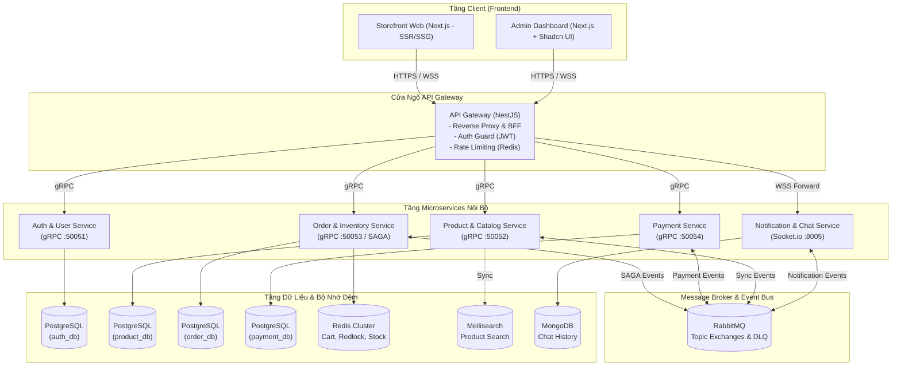

# Hệ Thống E-Commerce B2C (Microservices Architecture)

> Hệ thống website bán hàng trực tuyến B2C (Đơn thương hiệu) xây dựng theo kiến trúc **Pragmatic Microservices & Event-Driven** bằng **NestJS, Next.js, gRPC, RabbitMQ, PostgreSQL, Redis, MongoDB và Turborepo**.

---

## 1. Giới Thiệu Dự Án

Dự án cung cấp giải pháp thương mại điện tử hoàn chỉnh dành cho một thương hiệu bán lẻ trực tiếp tới người tiêu dùng (B2C), đồng thời làm chuẩn tham chiếu thực chiến cho các bài toán phân tán quy mô lớn:
* **Khách hàng (Storefront)**: Tìm kiếm siêu tốc qua Meilisearch, đặt hàng Flash Sale không lo nghẽn kho, thanh toán trực tuyến bảo mật, chat hỗ trợ thời gian thực (Realtime CSKH).
* **Quản trị viên (Admin Portal)**: Quản lý danh mục & biến thể đa cấp, điều phối đơn hàng, cấu hình khuyến mãi voucher và tiếp nhận phiên chat đa kênh.

---

## 2. Danh Mục Công Nghệ & Phiên Bản (Tech Stack & Versions)

| Tầng / Thành phần | Công nghệ Đề xuất | Phiên bản (Latest) | Vai trò Cốt lõi |
| :--- | :--- | :--- | :--- |
| **Frontend Storefront** | **Next.js + React** | `Next.js v16.x` / `React v19.x`| SSR/SSG tối ưu SEO, tải trang nhanh, Mobile-first. |
| **Frontend Admin** | **Next.js + Shadcn UI** | `Next.js v16.x` + `Tailwind v4.3.x` | Dashboard quản trị hiện đại, TanStack Table v8. |
| **Backend Core** | **NestJS + TypeScript**| `NestJS v12.x` + `TS v5.5+` | Khung phát triển chuẩn doanh nghiệp, hỗ trợ native gRPC. |
| **Giao tiếp Đồng bộ** | **gRPC + Protobuf** | `@grpc/grpc-js ^1.14.x` | Giao tiếp nội bộ tốc độ cao, độ trễ thấp giữa Gateway & Services. |
| **Giao tiếp Bất đồng bộ**| **RabbitMQ** | `rabbitmq:4.3-management-alpine`| Message Broker điều phối SAGA, Quorum Queues và DLQ. |
| **Primary Databases** | **PostgreSQL** | `postgres:18-alpine` | Đảm bảo tính toàn vẹn ACID cho Auth, Product, Order, Payment. |
| **ORM Client** | **Prisma ORM** | `prisma: ^6.x` | Quản lý schema, migrations và type-safe query. |
| **Connection Pooling** | **PgBouncer** | `edoburu/pgbouncer:v1.23.1` | Tối ưu hóa connection pool từ các container vào PostgreSQL. |
| **NoSQL Database** | **MongoDB** | `mongo:8.0` | Lưu trữ hội thoại Chat CSKH số lượng lớn, schema linh hoạt. |
| **Search Engine** | **Meilisearch** | `getmeili/meilisearch:v1.53` | Tìm kiếm sản phẩm tốc độ cao, tự sửa lỗi chính tả. |
| **Cache & In-Memory** | **Redis** | `redis:8.8-alpine` | Quản lý Giỏ hàng, Khóa phân tán (Redlock) chống Overselling. |
| **Realtime Gateway** | **Socket.io** | `socket.io: ^4.8.x` | Kênh WebSocket hai chiều thời gian thực cho Chat CSKH. |
| **Monorepo Tool** | **Turborepo + pnpm** | `turbo: ^2.10.x` + `pnpm: ^9.10.x`| Quản lý tập trung toàn bộ Apps và Shared Packages. |

---

## 3. Sơ Đồ Kiến Trúc Tổng Thể (System Architecture)



---

## 4. Cấu Trúc Monorepo (Turborepo Structure)

```text
e-commerce-b2c/
├── apps/
│   ├── storefront/             # Next.js: Giao diện người mua hàng (B2C Storefront)
│   ├── admin/                  # Next.js + Shadcn UI: Giao diện quản trị viên
│   ├── api-gateway/            # NestJS: API Gateway (BFF, Reverse Proxy)
│   ├── auth-service/           # NestJS: Service Xác thực & Tài khoản
│   ├── product-service/        # NestJS: Service Sản phẩm, Biến thể & Danh mục
│   ├── order-service/          # NestJS: Service Đơn hàng, Giỏ hàng & Kho (SAGA)
│   ├── payment-service/        # NestJS: Service Thanh toán trực tuyến & Webhook
│   └── chat-service/           # NestJS: Service Realtime Chat CSKH & Thông báo
├── packages/
│   ├── proto/                  # Chứa file .proto và script sinh code TypeScript
│   ├── contracts/              # DTO, Event Interfaces dùng chung toàn hệ thống
│   ├── database/               # Quản lý Prisma Schemas & Migrations cho từng database
│   ├── ui/                     # Design System dùng chung (Button, Input, Modal, Badge...)
│   ├── tailwind-config/        # Cấu hình TailwindCSS, Theme Tokens (Màu sắc, Radius)
│   ├── tsconfig/               # Cấu hình TypeScript chuẩn
│   └── eslint-config/          # Quy tắc Linting chuẩn toàn dự án
├── docker/
│   ├── docker-compose.yml      # Cụm hạ tầng: PostgreSQL, Redis, RabbitMQ, MongoDB, Meilisearch
│   └── docker-compose.apps.yml # Cụm Microservices chạy local
├── docs/                       # Thư mục tài liệu kỹ thuật chi tiết
├── package.json
├── turbo.json
└── README.md
```

---

## 5. Thư Mục Tài Liệu Kỹ Thuật Chi Tiết (Documentation Index)

Toàn bộ thiết kế chi tiết được tổ chức thành các tài liệu chuyên sâu trong thư mục `docs/`:

1. 🏛️ **[01. Kiến Trúc Hệ Thống (System Architecture)](docs/01-system-architecture.md)**: Chi tiết ranh giới nghiệp vụ, nhiệm vụ của API Gateway & 5 Microservices, phân bổ cổng mạng và RabbitMQ topology.
2. 🗄️ **[02. Thiết Kế Cơ Sở Dữ Liệu (Database Design)](docs/02-database-design.md)**: Toàn bộ bảng cơ sở dữ liệu PostgreSQL (`auth_db`, `product_db`, `order_db`, `payment_db`), MongoDB Collections và quy chuẩn Redis keys.
3. ⚡ **[03. Các Mẫu Thiết Kế Phân Tán (Distributed Patterns)](docs/03-distributed-patterns.md)**: Sơ đồ SAGA Orchestration, giải thuật chống bán lố Flash Sale (Lua Script), Transactional Outbox và Idempotency Key.
4. 🎨 **[04. Thiết Kế Giao Diện & Design System (Frontend)](docs/04-frontend-design-system.md)**: Phân tách triết lý Storefront vs Admin, hệ thống Design Tokens màu sắc, typography và thư viện `@repo/ui`.
5. 🚀 **[05. Lộ Trình Triển Khai (Roadmap & Milestones)](docs/05-roadmap.md)**: Kế hoạch phát triển 5 giai đoạn từ lúc khởi tạo Monorepo đến khi hoàn thiện sản phẩm.

---

## 6. Hướng Dẫn Khởi Chạy Nhanh (Quick Start)

### Yêu cầu tiên quyết:
* Node.js >= 22.x, `pnpm` >= 9.x hoặc `npm`
* Docker & Docker Compose

### Các bước khởi chạy:
```bash
# 1. Cài đặt toàn bộ dependencies trong Monorepo
pnpm install

# 2. Khởi chạy cụm cơ sở dữ liệu và message broker nền tảng
docker compose -f docker/docker-compose.yml up -d

# 3. Sinh mã nguồn TypeScript từ Protocol Buffers (.proto)
pnpm run proto:generate

# 4. Chạy toàn bộ ứng dụng ở chế độ Development
pnpm run dev
```