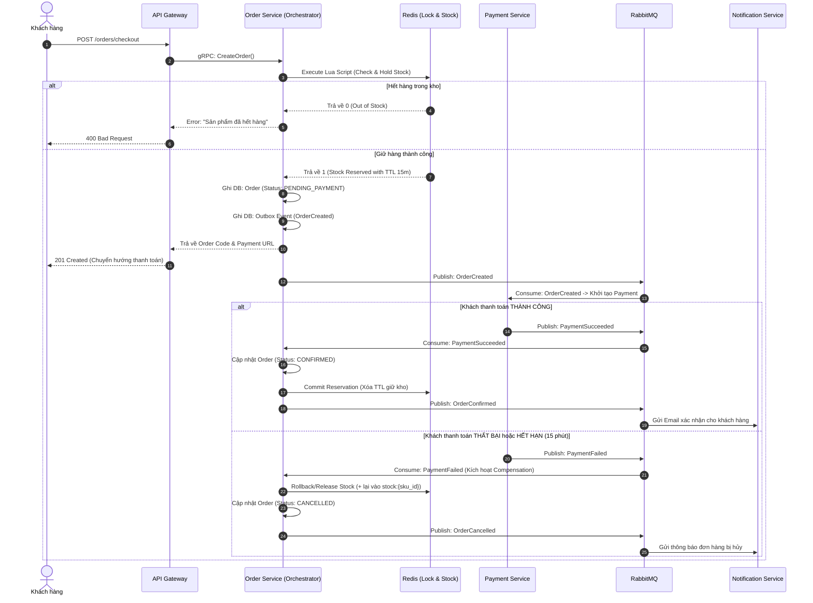

# 03. Các Mẫu Thiết Kế Phân Tán (Distributed Patterns Specification)

> Tài liệu này mô tả chi tiết các giải thuật và mẫu thiết kế phân tán cốt lõi được áp dụng trong hệ thống: **SAGA Orchestration**, **Anti-Overselling (Chống bán lố khi Flash Sale)**, **Transactional Outbox** và **Idempotency Key**.

---

## 1. SAGA Orchestration Pattern (Điều Phối Giao Dịch Phân Tán)

Trong kiến trúc Microservices (Database-per-Service), không thể dùng ACID Transaction cục bộ hay 2PC (Two-Phase Commit - do gây nghẽn và khóa tài nguyên). Hệ thống áp dụng **SAGA dạng Orchestrator** với **Order Service** làm trung tâm điều phối.

### 1.1. Sơ Đồ Sequence Hoàn Chỉnh



### 1.2. Giao Dịch Bù (Compensating Transactions)
Khi có bất kỳ bước nào thất bại, Orchestrator sẽ thực hiện chuỗi hành động ngược lại để đưa hệ thống về trạng thái nhất quán:
* **Nếu thanh toán thất bại**: Giải phóng số lượng tồn kho đã giữ trên Redis $\rightarrow$ Đổi trạng thái đơn hàng sang `CANCELLED` $\rightarrow$ Hoàn lại lượt sử dụng Voucher (nếu có).
* **Nếu cổng thanh toán lỗi sau khi đã trừ tiền khách**: Payment Service phát event `RefundRequired` $\rightarrow$ Tự động gọi API hoàn tiền sang cổng thanh toán.

---

## 2. Giải Thuật Chống Bán Vượt Tồn Kho (Anti-Overselling & Flash Sale)

Khi diễn ra Flash Sale, hàng ngàn khách hàng cùng bấm "Mua ngay" vào 1 SKU chỉ còn 5 sản phẩm. Nếu query trực tiếp database, Race-condition chắc chắn sẽ xảy ra.

### 2.1. Quy trình 3 Lớp Bảo Vệ (3-Tier Protection)

```text
[Request Đặt Hàng] 
       │
       ▼ (Lớp 1: In-Memory Redis Lua Script)
  Kiểm tra & Giảm Atomic tồn kho tức thì trong 1 mili-giây
       │ ──► [Hết hàng] ──► Báo lỗi ngay lập tức (Không chạm DB)
       ▼ (Hợp lệ)
  Tạo bản ghi Reservation kèm TTL 15 phút
       │
       ▼ (Lớp 2: PostgreSQL Inventory Reservation)
  Lưu vết giữ hàng vào bảng inventory_reservations
       │
       ▼ (Lớp 3: Payment Confirmation)
  Thanh toán thành công ──► Trừ hẳn tồn kho cơ sở trong PostgreSQL
```

### 2.2. Đoạn Mã Redis Lua Script (Atomic Hold Stock)
```lua
-- KEYS[1]: stock:{sku_id}
-- KEYS[2]: reservation:{order_id}:{sku_id}
-- ARGV[1]: Số lượng mua (quantity)
-- ARGV[2]: TTL giữ hàng tính bằng giây (ví dụ 900s = 15 phút)

local current_stock = tonumber(redis.call('get', KEYS[1]) or '0')
local requested_qty = tonumber(ARGV[1])

if current_stock >= requested_qty then
    -- Trừ tồn kho tức thì
    redis.call('decrby', KEYS[1], requested_qty)
    -- Tạo bản ghi giữ hàng có hạn sử dụng
    redis.call('setex', KEYS[2], tonumber(ARGV[2]), requested_qty)
    return 1 -- Thành công
else
    return 0 -- Thất bại: Không đủ hàng
end
```

---

## 3. Transactional Outbox Pattern (Chống Thất Thoát Sự Kiện)

### 3.1. Vấn Đề "Dual-Write":
Khi một Service thực hiện lưu dữ liệu vào Database và bắn sự kiện sang RabbitMQ:
* Nếu ghi Database xong mà Broker bị mất kết nối $\rightarrow$ Sự kiện bị mất, các service khác không biết đơn hàng đã được tạo.
* Nếu bắn sự kiện trước mà Database gặp lỗi Rollback $\rightarrow$ Các service khác nhận được sự kiện "ma".

### 3.2. Giải Pháp Outbox Pattern:
1. Trong **cùng một Local Transaction** của PostgreSQL:
   ```sql
   BEGIN;
   INSERT INTO orders (...) VALUES (...);
   INSERT INTO outbox_events (aggregate_type, event_type, payload, status) 
   VALUES ('ORDER', 'ORDER_CREATED', '{...}', 'PENDING');
   COMMIT;
   ```
2. Một **Background Relay Worker** (hoặc Debezium CDC) liên tục quét các bản ghi `status = 'PENDING'` trong bảng `outbox_events` $\rightarrow$ Đẩy vào RabbitMQ $\rightarrow$ Sau khi RabbitMQ xác nhận ACK thì đánh dấu `status = 'PUBLISHED'`.
3. Đảm bảo nguyên tắc **At-Least-Once Delivery** (Sự kiện luôn được gửi ít nhất một lần, không bao giờ mất).

---

## 4. Idempotency Key Pattern (Chống Trùng Lặp Giao Dịch)

* **Vấn đề**: Khi khách hàng bị lag mạng bấm nút "Thanh toán" 2 lần liên tiếp, hoặc phía ngân hàng gửi Webhook trùng lặp (IPN Retry).
* **Giải pháp**:
  * Mỗi request thanh toán bắt buộc phải gửi kèm một `Idempotency-Key` (sinh từ UUID ở client).
  * Payment Service lưu key này vào Redis với lệnh `SET key value NX EX 120`:
    * Nếu key đã tồn tại: Chặn ngay lập tức hoặc trả về kết quả của giao dịch trước đó.
    * Nếu key chưa có: Tiến hành xử lý thanh toán bình thường.
  * Bảng `payments` cũng đánh chỉ mục `UNIQUE(idempotency_key)` để bảo vệ ở tầng cơ sở dữ liệu.
